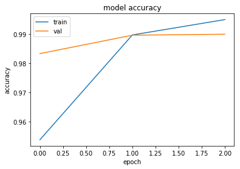
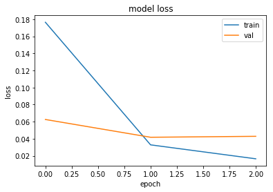
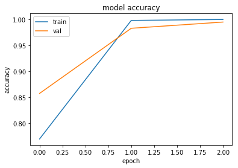
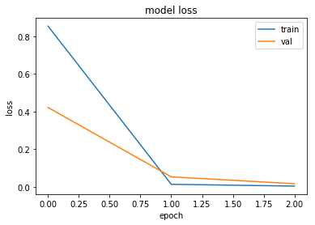

# Report for question 3

## Learning Curves
A loss function or cost function is a function that maps an event or values of one or more variables onto a real number intuitively representing some “cost” associated with the event. An optimization problem seeks to minimize a loss function.
Loss value implies how well or poorly a certain model behaves after each iteration of optimization. Ideally, one would expect the reduction of loss after each, or several, iteration(s).
The accuracy of a model is usually determined after the model parameters are learned and fixed and no learning is taking place. Then the test samples are fed to the model and the number of mistakes (zero-one loss) the model makes are recorded, after comparison to the true targets. Then the percentage of misclassification is calculated.

### MNIST classification

#### Accuracy

#### Loss

### Custom Image classification

#### Accuracy

#### Loss

## F-Scores
It is difficult to compare two models with low precision and high recall or vice versa. So to make them comparable, we use F-Score. F-score helps to measure Recall and Precision at the same time. It uses Harmonic Mean in place of Arithmetic Mean by punishing the extreme values more.
`F-score = (2 * Recall * Precision)/(Recall+Precision)`
 
Precision
Out of all the classes, how much we predicted correctly. It should be high as possible.
`Precision = TP/(TP+FP)`
Recall
Out of all the positive classes, how much we predicted correctly. It should be high as possible.
Recall = TP/(TP+FP)

  - Positive (P ) : Observation is positive (for example: is an apple).
  - Negative (N) : Observation is not positive (for example: is not an apple).
  - True Positive (TP) : Observation is positive, and is predicted to be positive.
  - False Negative (FN) : Observation is positive, but is predicted negative.
  - True Negative (TN) : Observation is negative, and is predicted to be negative.
  - False Positive (FP) : Observation is negative, but is predicted positive.

### MNIST classification
`[0.99087221 0.98978232 0.98603755 0.98909812 0.98298092 0.9893438
 0.98800209 0.98981077 0.98206048 0.9798129 ]`
### Custom Image classification
```
[0.99259259 0.91848907 0.99807322 0.91914894 0.99800399 0.985138
 1.         0.99625468 1.         0.98412698 1.         0.99092559
 1.         1.         0.97847358 0.99245283 0.97912713 0.99118943
 1.         1.         0.99593496 1.         0.99570815 0.99032882
 1.         1.         1.         1.         1.         1.
 1.         1.         1.         1.         0.99596774 1.
 1.         1.         1.         1.         1.         1.
 1.         1.         1.         1.         1.         1.
 1.         1.         1.         1.         1.         1.
 1.         1.         1.         1.         0.99593496 1.
 1.         1.         1.         1.         1.         1.
 1.         1.         1.         1.         1.         1.
 1.         1.         1.         1.         1.         1.
 1.         1.         1.         1.         1.         1.
 1.         1.         1.         1.         1.         1.
 1.         1.         1.         1.         1.         1.        ]
 ```
## Confusion Matrices
A confusion matrix is a table that is often used to describe the performance of a classification model (or "classifier") on a set of test data for which the true values are known.
Each row of the matrix represents the instances in a predicted class while each column represents the instances in an actual class (or vice versa).
### MNIST classification
```
[[ 977    0    0    0    0    0    2    1    0    0]
 [   4 1114    4    3    0    0    2    2    6    0]
 [   0    0 1024    0    1    0    0    5    2    0]
 [   0    0    4  998    0    4    0    0    4    0]
 [   0    0    0    0  953    0    4    0    1   24]
 [   2    0    0    4    0  882    3    0    0    1]
 [   5    1    1    0    1    2  947    0    1    0]
 [   0    0    7    1    0    0    0 1020    0    0]
 [   4    0    5    1    0    1    1    2  958    2]
 [   0    1    0    1    2    2    0    3    5  995]]
```
### Custom Image classification
It is of 96x96 size. So it is not possible to show it here. It is given as `confusion_line.npy`.
```
[[268   4   0 ...   0   0   0]
 [  0 231   0 ...   0   0   0]
 [  0   0 259 ...   0   0   0]
 ...
 [  0   0   0 ... 255   0   0]
 [  0   0   0 ...   0 264   0]
 [  0   0   0 ...   0   0 241]]
```
## Variations tried
### MNIST classification
We tried 2 variations:-
  ```
  Epochs = 3
  Batch_size = 100
  Layers = CNN layer with 10 fiter size(7,7)
  Acurr = 90.125 %
  ```
  ```
  Epochs = 3
  Batch_size = 300
  Layers =CNN layer with 32 fiter size(7,7)
  Acurr = 98.68 %
  ```
### Custom Image classification
We tried 2 variations:-
  ```
  Epochs = 3
  Batch_size = 100
  Layers = CNN layer with 200 fiter size(7,7)
  Acurr = 92.125 %
  ```
  ```
  Epochs = 3
  Batch_size = 100
  Layers = CNN layer with 50 fiter size(7,7)
  Acurr = 99.68 %
  ```

## Inferences
  - The CNN network easily learned both the datasets in 2-3
  epochs.
