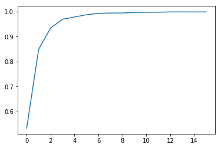
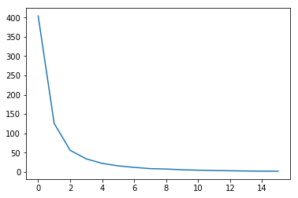

# Assignment-2 Question-3
## Learning Curves
### Overall Accuracy

### Loss

## F-Scores
### Length Prediction
`[1. 1.]`
### Width Prediction
`[1. 1.]`
### Color predictions
`[1. 1.]`
### Angle Prediction
```
[0.99940263 0.99727355 0.99758454 0.9997037  0.9997037  0.99969031
 0.99912765 0.9994128  1.         1.         0.99878419 0.99847886]
 ```
## Confusion Matrices
### Length Prediction
```
[[ 9940     0]
 [    0 10060]]
```
### Width Prediction
```
[[ 9994     0]
 [    0 10006]]
```
### Color predictions
```
[[ 9962     0]
 [    0 10038]]
```
### Angle Prediction
```
[[1673    0    0    0    0    0    0    0    0    0    0    0]
 [   1 1646    6    0    0    0    0    0    0    0    0    0]
 [   0    2 1652    0    0    0    0    0    0    0    0    0]
 [   0    0    0 1687    1    0    0    0    0    0    0    0]
 [   0    0    0    0 1687    0    0    0    0    0    0    0]
 [   0    0    0    0    0 1614    1    0    0    0    0    0]
 [   0    0    0    0    0    0 1718    0    0    0    0    0]
 [   0    0    0    0    0    0    2 1702    0    0    0    0]
 [   0    0    0    0    0    0    0    0 1649    0    0    0]
 [   0    0    0    0    0    0    0    0    0 1670    0    0]
 [   0    0    0    0    0    0    0    0    0    0 1643    1]
 [   1    0    0    0    0    0    0    0    0    0    3 1641]]
```
## Variations tried
  - Changed filters to 16 and 32. Lead to overfitting.
  - Increased dense layers to 512. Lead to overfitting.
## Inferences
  - Only misclassification is happening in predicting the angles.
  - Even then, angles are misclassified as angles close to the original angles.
